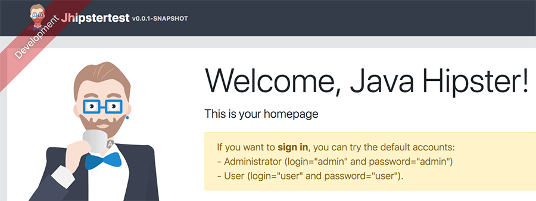
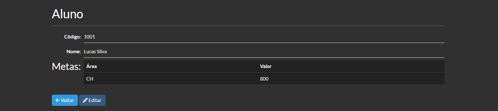
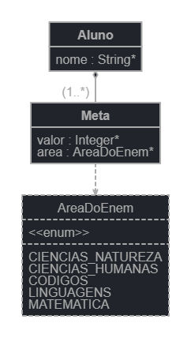
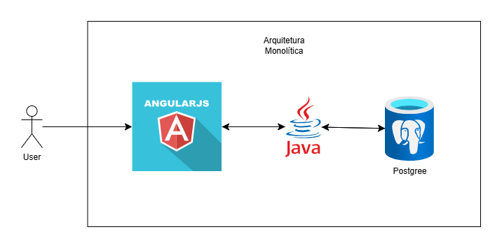

<h1>Case - Cadastro de Metas para ENEM</h1>


## 📌 Índice

- [Objetivo](#objetivo)
- [Vídeo](#video)
- [Funcionalidades](#funcionalidades)
- [Estrutura de pastas](#estrutura-de-pastas)
- [Tecnologias Utilizadas](#tecnologias-utilizadas)
- [Base de Dados](#base-de-dados)
- [Arquitetura do Projeto](#arquitetura-do-projeto)
- [Autor](#autor)

## Objetivo

Criar uma aplicação completa do zero utilizando a ferramenta JHipster para o cadastro de metas dos alunos.
Um aluno possui metas de notas nas 4 áreas do ENEM (linguagens, códigos e suas tecnologias; ciências humanas
e suas tecnologias; ciências da natureza e suas tecnologias; e matemática e suas tecnologias).
É necessário apenas o acesso de administrador (gerado automaticamente), e o próprio administrador cadastrar
um aluno e em seguida cadastrar a meta de nota desse aluno.

## Vídeo

[Acesse o link para ver o vídeo de demonstração: ](URL)

## Funcionalidades

**1. Cadastro de Alunos:**  
Permitir que o administrador cadastre alunos no sistema, armazenando informações básicas como o nome.

**2. Cadastro de Metas:**  
Gerenciar metas de notas relacionadas às 4 áreas do ENEM, vinculando-as a cada aluno cadastrado.

**3. Gestão de Usuários:**  
O sistema é restrito ao uso de um administrador, com credenciais padrão pré-definidas (admin/admin) geradas automaticamente.

Exemplo de Uso Avaliado

1. Logar na plataforma utilizando as credenciais padrão de administrador (`admin/admin`).
2. Cadastrar um aluno chamado **Lucas**.
3. Criar uma meta com o valor de **800 pontos** para o aluno **Lucas**.



## Estrutura de pastas

<pre> ``` 
my-jhipster-app/
├── .mvn/                            # Arquivos de configuração do Maven
│   ├── wrapper/
├── .yo-rc.json                      # Configuração do JHipster
├── mvnw                             # Wrapper do Maven
├── mvnw.cmd                         # Wrapper do Maven para Windows
├── pom.xml                          # Arquivo de configuração do Maven
├── src/                             # Código fonte do projeto
│   ├── main/
│   │   ├── java/                    # Código Java
│   │   │   ├── com/
│   │   │   │   └── mycompany/       # Pacote do projeto
│   │   │   │       ├── config/      # Configurações do Spring
│   │   │   │       ├── domain/      # Classes de domínio (Entidades)
│   │   │   │       ├── repository/  # Repositórios (DAO)
│   │   │   │       ├── service/     # Lógica de negócio (Serviços)
│   │   │   │       ├── web/         # Controladores REST e Web
│   │   │   │       │   └── rest/    # Endpoints REST do aplicativo
│   │   │   │       │       └── MetaResource.java
│   │   ├── resources/
│   │   │   ├── config/              # Arquivos de configuração do Spring
│   │   │   ├── db/                  # Scripts de banco de dados
│   │   │   ├── static/              # Arquivos estáticos (CSS, JS, imagens)
│   │   │   ├── templates/           # Templates do Thymeleaf, caso aplicável
│   │   │   └── application.yml      # Configurações principais do aplicativo
│   │   └── webapp/
│   │       ├── app/                 # Código do frontend (Angular)
│   │       │   ├── app.module.ts    # Módulo principal do Angular
│   │       │   ├── components/      # Componentes do Angular
│   │       │   ├── services/        # Serviços do Angular
│   │       │   ├── shared/          # Componentes compartilhados
│   │       │   └── entities/        # Entidades do Angular
│   │       ├── index.html           # Página inicial do Angular
│   │       └── assets/              # Arquivos estáticos do frontend
│   └── test/                        # Testes do projeto
│       ├── java/
│       │   └── com/
│       │       └── mycompany/       # Testes do código Java
│       └── resources/
│           └── application.yml      # Configurações para os testes
├── target/                          # Diretório onde os arquivos gerados pelo Maven são armazenados
├── .gitignore                       # Arquivo para ignorar arquivos do Git
├── README.md                        # Arquivo de documentação do projeto
├── .editorconfig                    # Configuração do editor de código
└── LICENSE                          # Licença do projeto

```</pre>

## Base de Dados



## Tecnologias Utilizadas

- **Backend:** Spring Boot (Java).
- **Frontend:** Angular.
- **Banco de Dados:** PostgreSQL (utilizado para desenvolvimento e produção).

## Arquitetura do Projeto

Projeto JHipster utilizando arquitetura monolítica, ou seja, todos os componentes da aplicação estão interconectados e executados juntos. Sendo que:

- Angular é a interface do usuário (frontend), onde o usuário interage com a aplicação.
- Java é o servidor (backend), responsável por processar a lógica de negócios, manipular dados e fornecer respostas às requisições do cliente.
- PostgreSQL é o banco de dados, onde as informações são armazenadas.



## Autor

Pâmela Aliny Cleto Pavan
e-mail: pamelaaliny@gmail.com
